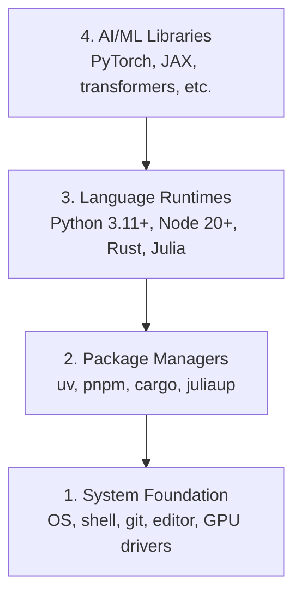

# Dev Environment
开发环境

> Your tools shape your thinking. Set them up once, set them up right.
> 你的工具会塑造你的思维方式。一次配置到位，后面就会轻松很多。

**Type:** Build
**类型：** Build
**Languages:** Python, Node.js, Rust
**语言：** Python、Node.js、Rust
**Prerequisites:** None
**前置要求：** 无
**Time:** ~45 minutes
**耗时：** 约 45 分钟

## Learning Objectives
学习目标

- Set up Python 3.11+, Node.js 20+, and Rust toolchains from scratch
---
- 从零开始安装并配置 Python 3.11+、Node.js 20+ 与 Rust 工具链
- Configure virtual environments and package managers for reproducible builds
---
- 配置虚拟环境和包管理器，确保构建过程可复现
- Verify GPU access with CUDA/MPS and run a test tensor operation
---
- 使用 CUDA/MPS 验证 GPU 可用性，并运行一个测试张量运算
- Understand the four-layer stack: system, packages, runtimes, AI libraries
---
- 理解四层技术栈：系统、包管理、运行时、AI 库

## The Problem
问题所在

You're about to learn AI engineering across 200+ lessons using Python, TypeScript, Rust, and Julia. If your environment is broken, every single lesson becomes a fight against tooling instead of learning.

你将通过 200 多节课程学习 AI Engineering，并使用 Python、TypeScript、Rust 和 Julia。如果开发环境一开始就有问题，那么之后的每一节课都可能变成和工具链搏斗，而不是专注学习本身。

Most people skip environment setup. Then they spend hours debugging import errors, version conflicts, and missing CUDA drivers. We're going to do this once, properly.

很多人都会跳过环境配置这一步。结果就是后面花上几个小时去排查导入错误、版本冲突和缺失的 CUDA 驱动。我们这次要一次性把它做好。

## The Concept
核心概念

An AI engineering environment has four layers:

一个 AI Engineering 开发环境通常由四层组成：



We install bottom-up. Each layer depends on the one below it.

我们按照“自下而上”的顺序来安装。每一层都依赖于它下面的那一层。

## Build It
动手搭建

### Step 1: System Foundation
### 第 1 步：系统基础层

Check your system and install the basics.

先检查你的系统，并安装最基础的工具。

```bash
# macOS
xcode-select --install
brew install git curl wget

# Ubuntu/Debian
sudo apt update && sudo apt install -y build-essential git curl wget

# Windows (use WSL2)
wsl --install -d Ubuntu-24.04
```

### Step 2: Python with uv
### 第 2 步：用 uv 安装 Python

We use `uv` — it's 10-100x faster than pip and handles virtual environments automatically.

我们使用 `uv`——它比 pip 快 10 到 100 倍，而且还能自动处理虚拟环境。

```bash
curl -LsSf https://astral.sh/uv/install.sh | sh

uv python install 3.12

uv venv
source .venv/bin/activate  # or .venv\Scripts\activate on Windows

uv pip install numpy matplotlib jupyter
```

Verify:

验证如下：

```python
import sys
print(f"Python {sys.version}")

import numpy as np
print(f"NumPy {np.__version__}")
a = np.array([1, 2, 3])
print(f"Vector: {a}, dot product with itself: {np.dot(a, a)}")
```

### Step 3: Node.js with pnpm
### 第 3 步：用 pnpm 安装 Node.js

For TypeScript lessons (agents, MCP servers, web apps).

这一步是为 TypeScript 相关课程准备的，例如 agents、MCP servers 和 Web 应用。

```bash
curl -fsSL https://fnm.vercel.app/install | bash
fnm install 22
fnm use 22

npm install -g pnpm

node -e "console.log('Node', process.version)"
```

### Step 4: Rust
### 第 4 步：安装 Rust

For performance-critical lessons (inference, systems).

这一步用于性能敏感的课程内容，例如推理系统和底层工程系统。

```bash
curl --proto '=https' --tlsv1.2 -sSf https://sh.rustup.rs | sh

rustc --version
cargo --version
```

### Step 5: Julia (Optional)
### 第 5 步：Julia（可选）

For math-heavy lessons where Julia shines.

这一部分主要服务于数学较重的课程，Julia 在这些场景中表现很出色。

```bash
curl -fsSL https://install.julialang.org | sh

julia -e 'println("Julia ", VERSION)'
```

### Step 6: GPU Setup (If You Have One)
### 第 6 步：GPU 配置（如果你有 GPU）

```bash
# NVIDIA
nvidia-smi

# Install PyTorch with CUDA
uv pip install torch torchvision torchaudio --index-url https://download.pytorch.org/whl/cu124
```

```python
import torch
print(f"CUDA available: {torch.cuda.is_available()}")
if torch.cuda.is_available():
    print(f"GPU: {torch.cuda.get_device_name(0)}")
```

No GPU? No problem. Most lessons work on CPU. For training-heavy lessons, use Google Colab or cloud GPUs.

没有 GPU 也没关系。大多数课程都可以在 CPU 上完成。对于训练量较大的课程，可以使用 Google Colab 或云端 GPU。

### Step 7: Verify Everything
### 第 7 步：验证所有环境

Run the verification script:

运行下面的验证脚本：

```bash
python phases/00-setup-and-tooling/01-dev-environment/code/verify.py
```

## Use It
投入使用

Your environment is now ready for every lesson in this course. Here's what you'll use where:

现在你的环境已经可以支持本课程中的所有内容。下面是不同语言在课程中的用途：

| Language | Used In | Package Manager |
|----------|---------|-----------------|
| Python | Phases 1-12 (ML, DL, NLP, Vision, Audio, LLMs) | uv |
| TypeScript | Phases 13-17 (Tools, Agents, Swarms, Infra) | pnpm |
| Rust | Phases 12, 15-17 (Performance-critical systems) | cargo |
| Julia | Phase 1 (Math foundations) | Pkg |

| 语言 | 使用阶段 | 包管理器 |
|------|----------|----------|
| Python | 第 1-12 阶段（ML、DL、NLP、Vision、Audio、LLMs） | uv |
| TypeScript | 第 13-17 阶段（Tools、Agents、Swarms、Infra） | pnpm |
| Rust | 第 12、15-17 阶段（性能关键系统） | cargo |
| Julia | 第 1 阶段（数学基础） | Pkg |

## Ship It
产出成果

This lesson produces a verification script that anyone can run to check their setup.

这一课会产出一个验证脚本，任何人都可以运行它来检查自己的开发环境是否配置正确。

See `outputs/prompt-env-check.md` for a prompt that helps AI assistants diagnose environment issues.

你还可以查看 `outputs/prompt-env-check.md`，其中提供了一个可用于让 AI 助手诊断环境问题的 prompt。

## Exercises
练习

1. Run the verification script and fix any failures
---
1. 运行验证脚本，并修复所有失败项
2. Create a Python virtual environment for this course and install PyTorch
---
2. 为这门课创建一个 Python 虚拟环境，并安装 PyTorch
3. Write a "hello world" in all four languages and run each one
---
3. 分别用四种语言写一个 “hello world”，并成功运行它们
