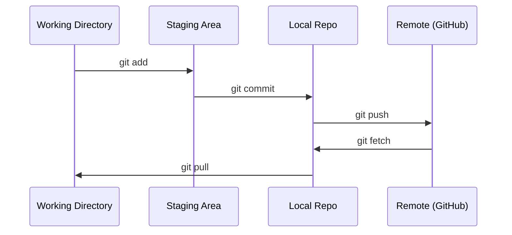

# Git & Collaboration
Git 与协作

> Version control is not optional. Every experiment, every model, every lesson you build here gets tracked.
> 版本控制不是可选项。你在这里完成的每一次实验、每一个模型、每一节课程练习，都应该被记录下来。

**Type:** Learn
**类型：** Learn
**Languages:** --
**语言：** --
**Prerequisites:** Phase 0, Lesson 01
**前置要求：** 第 0 阶段，第 01 课
**Time:** ~30 minutes
**耗时：** 约 30 分钟

## Learning Objectives
学习目标

- Configure git identity and use the daily workflow of add, commit, and push
---
- 配置 git 身份信息，并掌握 add、commit、push 的日常工作流
- Create and merge branches for isolated experiments without breaking main
---
- 为独立实验创建并合并分支，同时不破坏 main 主线
- Write a `.gitignore` that excludes model checkpoints and large binary files
---
- 编写 `.gitignore`，排除模型检查点和大型二进制文件
- Navigate the commit history with `git log` to understand project evolution
---
- 使用 `git log` 浏览提交历史，理解项目是如何演进的

## The Problem
问题所在

You're about to write hundreds of code files across 20 phases. Without version control you will lose work, break things you can't undo, and have no way to collaborate with others.

接下来你会在 20 个阶段中编写数百个代码文件。如果没有版本控制，你会丢失工作成果、改坏内容却无法回退，也无法和他人高效协作。

Git is the tool. GitHub is where the code lives. This lesson covers what you need for this course and nothing more.

Git 是工具，GitHub 是代码托管的地方。这节课只讲你完成这门课程真正需要的部分，不会多讲无关内容。

## The Concept
核心概念



Three things to remember:

有三件事必须牢牢记住：

1. Save often (`git commit`)
---
1. 经常保存快照（`git commit`）
2. Push to remote (`git push`)
---
2. 把本地进度推送到远端（`git push`）
3. Branch for experiments (`git checkout -b experiment`)
---
3. 做实验时新建分支（`git checkout -b experiment`）

## Build It
动手实践

### Step 1: Configure git
### 第 1 步：配置 git

```bash
git config --global user.name "Your Name"
git config --global user.email "you@example.com"
```

### Step 2: The daily workflow
### 第 2 步：日常工作流

```bash
git status
git add file.py
git commit -m "Add perceptron implementation"
git push origin main
```

### Step 3: Branching for experiments
### 第 3 步：为实验创建分支

```bash
git checkout -b experiment/new-optimizer

# ... make changes, commit ...

git checkout main
git merge experiment/new-optimizer
```

### Step 4: Working with this course repo
### 第 4 步：在本课程仓库中工作

```bash
git clone https://github.com/rohitg00/ai-engineering-from-scratch.git
cd ai-engineering-from-scratch

git checkout -b my-progress
# work through lessons, commit your code
git push origin my-progress
```

## Use It
实际使用

For this course, you need exactly these commands:

对于这门课，你真正需要掌握的命令就是下面这些：

| Command | When |
|---------|------|
| `git clone` | Get the course repo |
| `git add` + `git commit` | Save your work |
| `git push` | Back it up to GitHub |
| `git checkout -b` | Try something without breaking main |
| `git log --oneline` | See what you've done |

| 命令 | 使用场景 |
|------|----------|
| `git clone` | 获取课程仓库 |
| `git add` + `git commit` | 保存你的工作进度 |
| `git push` | 把内容备份到 GitHub |
| `git checkout -b` | 在不影响 main 的前提下尝试新东西 |
| `git log --oneline` | 查看自己已经做过什么 |

That's it. You don't need rebase, cherry-pick, or submodules for this course.

就这些。对于这门课程来说，你不需要 rebase、cherry-pick 或 submodule 才能顺利学习。

## Exercises
练习

1. Clone this repo, create a branch called `my-progress`, make a file, commit it, push it
---
1. 克隆这个仓库，创建一个名为 `my-progress` 的分支，新建一个文件，提交并推送它
2. Create a `.gitignore` that excludes model checkpoint files (`.pt`, `.pth`, `.safetensors`)
---
2. 编写一个 `.gitignore`，排除模型检查点文件（`.pt`、`.pth`、`.safetensors`）
3. Look at the commit history of this repo with `git log --oneline` and read how lessons were added
---
3. 使用 `git log --oneline` 查看这个仓库的提交历史，了解这些课程是如何逐步加入的

## Key Terms
关键术语

| Term | What people say | What it actually means |
|------|----------------|----------------------|
| Commit | "Saving" | A snapshot of your entire project at a point in time |
| Branch | "A copy" | A pointer to a commit that moves forward as you work |
| Merge | "Combining code" | Taking changes from one branch and applying them to another |
| Remote | "The cloud" | A copy of your repo hosted somewhere else (GitHub, GitLab) |

| 术语 | 人们常说的意思 | 实际含义 |
|------|----------------|----------|
| Commit | “保存” | 你整个项目在某一时刻的快照 |
| Branch | “一个副本” | 指向某个提交的指针，并会随着你的工作继续向前移动 |
| Merge | “合并代码” | 把一个分支上的更改应用到另一个分支上 |
| Remote | “云端” | 托管在别处的仓库副本（如 GitHub、GitLab） |
