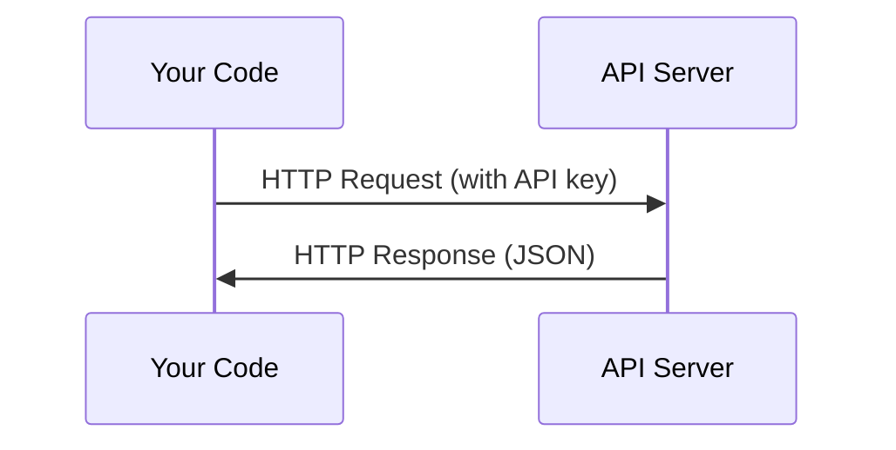

# APIs & Keys
API 与密钥

> Every AI API works the same way: send a request, get a response. The details change, the pattern doesn't.
> 所有 AI API 的工作方式本质上都一样：发送请求，获得响应。细节会变，但模式不会变。

**Type:** Build
**类型：** Build
**Languages:** Python, TypeScript
**语言：** Python、TypeScript
**Prerequisites:** Phase 0, Lesson 01
**前置要求：** 第 0 阶段，第 01 课
**Time:** ~30 minutes
**耗时：** 约 30 分钟

## Learning Objectives
学习目标

- Store API keys securely using environment variables and `.env` files
---
- 使用环境变量和 `.env` 文件安全地保存 API 密钥
- Make an LLM API call using both the Anthropic Python SDK and raw HTTP
---
- 同时使用 Anthropic Python SDK 和原始 HTTP 发起一次 LLM API 调用
- Compare SDK-based and raw HTTP request/response formats for debugging
---
- 对比基于 SDK 与原始 HTTP 的请求/响应格式，以便调试
- Identify and handle common API errors including authentication and rate limits
---
- 识别并处理常见 API 错误，包括鉴权失败和速率限制

## The Problem
问题所在

Starting from Phase 11, you'll call LLM APIs (Anthropic, OpenAI, Google). In Phase 13-16 you'll build agents that use these APIs in loops. You need to know how API keys work, how to store them safely, and how to make your first API call.

从第 11 阶段开始，你会调用各种 LLM API（Anthropic、OpenAI、Google）。在第 13 到第 16 阶段中，你还会构建在循环中持续调用这些 API 的 agents。你需要先理解 API 密钥的工作方式、如何安全保存它们，以及如何发起你的第一次 API 调用。

## The Concept
核心概念



Every API call has:

每一次 API 调用都包含：

1. An endpoint (URL)
---
1. 一个端点（URL）
2. An API key (authentication)
---
2. 一个 API 密钥（用于认证）
3. A request body (what you want)
---
3. 一个请求体（你想让它做什么）
4. A response body (what you get back)
---
4. 一个响应体（它返回给你的内容）

## Build It
动手实践

### Step 1: Store API keys safely
### 第 1 步：安全保存 API 密钥

Never put API keys in code. Use environment variables.

永远不要把 API 密钥直接写进代码里。请使用环境变量。

```bash
export ANTHROPIC_API_KEY="sk-ant-..."
export OPENAI_API_KEY="sk-..."
```

Or use a `.env` file (add it to `.gitignore`):

也可以使用 `.env` 文件（并把它加入 `.gitignore`）：

```
ANTHROPIC_API_KEY=sk-ant-...
OPENAI_API_KEY=sk-...
```

### Step 2: First API call (Python)
### 第 2 步：第一次 API 调用（Python）

```python
import anthropic

client = anthropic.Anthropic()

response = client.messages.create(
    model="claude-sonnet-4-20250514",
    max_tokens=256,
    messages=[{"role": "user", "content": "What is a neural network in one sentence?"}]
)

print(response.content[0].text)
```

### Step 3: First API call (TypeScript)
### 第 3 步：第一次 API 调用（TypeScript）

```typescript
import Anthropic from "@anthropic-ai/sdk";

const client = new Anthropic();

const response = await client.messages.create({
  model: "claude-sonnet-4-20250514",
  max_tokens: 256,
  messages: [{ role: "user", content: "What is a neural network in one sentence?" }],
});

console.log(response.content[0].text);
```

### Step 4: Raw HTTP (no SDK)
### 第 4 步：原始 HTTP 调用（不用 SDK）

```python
import os
import urllib.request
import json

url = "https://api.anthropic.com/v1/messages"
headers = {
    "Content-Type": "application/json",
    "x-api-key": os.environ["ANTHROPIC_API_KEY"],
    "anthropic-version": "2023-06-01",
}
body = json.dumps({
    "model": "claude-sonnet-4-20250514",
    "max_tokens": 256,
    "messages": [{"role": "user", "content": "What is a neural network in one sentence?"}],
}).encode()

req = urllib.request.Request(url, data=body, headers=headers, method="POST")
with urllib.request.urlopen(req) as resp:
    result = json.loads(resp.read())
    print(result["content"][0]["text"])
```

This is what the SDKs do under the hood. Understanding the raw HTTP call helps when debugging.

这就是 SDK 在底层帮你做的事情。理解原始 HTTP 调用方式，会在你调试问题时非常有帮助。

## Use It
实际使用

For this course:

在这门课程中：

| API | When you need it | Free tier |
|-----|-----------------|-----------|
| Anthropic (Claude) | Phases 11-16 (agents, tools) | $5 credit on signup |
| OpenAI | Phase 11 (comparison) | $5 credit on signup |
| Hugging Face | Phases 4-10 (models, datasets) | Free |

| API | 何时需要 | 免费额度 |
|-----|----------|----------|
| Anthropic (Claude) | 第 11-16 阶段（agents、tools） | 注册送 $5 额度 |
| OpenAI | 第 11 阶段（对比实验） | 注册送 $5 额度 |
| Hugging Face | 第 4-10 阶段（models、datasets） | 免费 |

You don't need all of them right now. Set them up when the lesson requires it.

你现在不需要一次性把所有服务都配好。等课程真的需要时再配置即可。

## Ship It
产出成果

This lesson produces:

这一课会产出：

- `outputs/prompt-api-troubleshooter.md` - diagnose common API errors
---
- `outputs/prompt-api-troubleshooter.md` —— 用于诊断常见 API 错误

## Exercises
练习

1. Get an Anthropic API key and make your first API call
---
1. 获取一个 Anthropic API key，并完成你的第一次 API 调用
2. Try the raw HTTP version and compare the response format to the SDK version
---
2. 尝试原始 HTTP 版本，并把响应格式和 SDK 版本做对比
3. Intentionally use a wrong API key and read the error message
---
3. 故意使用错误的 API key，并观察错误信息

## Key Terms
关键术语

| Term | What people say | What it actually means |
|------|----------------|----------------------|
| API key | "Password for the API" | A unique string that identifies your account and authorizes requests |
| Rate limit | "They're throttling me" | Maximum requests per minute/hour to prevent abuse and ensure fair usage |
| Token | "A word" (in API context) | A billing unit: input and output tokens are counted and charged separately |
| Streaming | "Real-time responses" | Getting the response word by word instead of waiting for the full response |

| 术语 | 人们常说的意思 | 实际含义 |
|------|----------------|----------|
| API key | “API 的密码” | 一个用于识别你的账户并授权请求的唯一字符串 |
| Rate limit | “他们在限速我” | 每分钟/每小时可发起请求的最大次数，用来防止滥用并保证公平使用 |
| Token | “一个单词” （在 API 语境中） | 一种计费单位：输入与输出 token 会分别统计并收费 |
| Streaming | “实时响应” | 不必等待完整结果，而是逐词或逐块地接收响应 |
