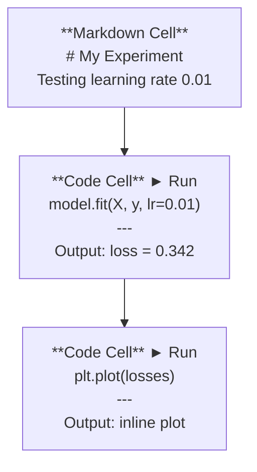
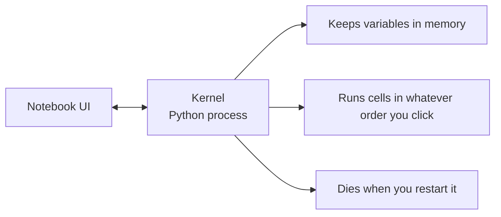

# Jupyter Notebooks
Jupyter Notebooks

> Notebooks are the lab bench of AI engineering. You prototype here, then move what works into production.
> Notebook 是 AI Engineering 的实验台。你在这里做原型，然后把验证过的东西迁移到生产环境。

**Type:** Build
**类型：** Build
**Languages:** Python
**语言：** Python
**Prerequisites:** Phase 0, Lesson 01
**前置要求：** 第 0 阶段，第 01 课
**Time:** ~30 minutes
**耗时：** 约 30 分钟

## Learning Objectives
学习目标

- Install and launch JupyterLab, Jupyter Notebook, or VS Code with the Jupyter extension
---
- 安装并启动 JupyterLab、Jupyter Notebook，或带 Jupyter 扩展的 VS Code
- Use magic commands (`%timeit`, `%%time`, `%matplotlib inline`) to benchmark and visualize inline
---
- 使用 magic commands（`%timeit`、`%%time`、`%matplotlib inline`）做基准测试并内联可视化
- Distinguish when to use notebooks vs scripts and apply the "explore in notebooks, ship in scripts" workflow
---
- 区分 notebook 与 script 的适用场景，并实践“在 notebook 中探索，在 script 中交付”的工作流
- Identify and avoid common notebook traps: out-of-order execution, hidden state, and memory leaks
---
- 识别并避免 notebook 的常见陷阱：乱序执行、隐藏状态和内存泄漏

## The Problem
问题所在

Every AI paper, tutorial, and Kaggle competition uses Jupyter notebooks. They let you run code in pieces, see outputs inline, mix code with explanations, and iterate fast. If you try to learn AI without notebooks, you're doing math homework without scratch paper.

几乎所有 AI 论文、教程和 Kaggle 比赛都会使用 Jupyter notebooks。它允许你分段运行代码、内联查看输出、把代码和解释混写在一起，并快速迭代。如果你不使用 notebook 来学习 AI，就像做数学题却没有草稿纸一样。

But notebooks have real traps. People use them for everything, including things they're terrible at. Knowing when to use a notebook and when to use a script will save you from debugging nightmares later.

但 notebook 也确实有陷阱。很多人什么都拿它做，包括那些它并不擅长的工作。知道什么时候该用 notebook，什么时候该写 script，能帮你避免后面大量调试噩梦。

## The Concept
核心概念

A notebook is a list of cells. Each cell is either code or text.

Notebook 本质上是一个由多个 cell 组成的列表。每个 cell 要么是代码，要么是文本。



The kernel is a Python process running in the background. When you run a cell, it sends the code to the kernel, which executes it and sends back the result. All cells share the same kernel, so variables persist between cells.

Kernel 是后台运行的一个 Python 进程。当你运行某个 cell 时，代码会被发给 kernel 执行，然后再把结果返回。所有 cell 共用同一个 kernel，所以变量会在不同 cell 之间持续存在。



That "whatever order you click" part is both the superpower and the foot-gun.

“你点哪个就按哪个顺序运行”这一点，既是 notebook 的超能力，也是最容易坑人的地方。

## Build It
动手实践

### Step 1: Pick your interface
### 第 1 步：选择你的界面

Three options, one format:

三种界面，同一种文件格式：

| Interface | Install | Best for |
|-----------|---------|----------|
| JupyterLab | `pip install jupyterlab` then `jupyter lab` | Full IDE experience, multiple tabs, file browser, terminal |
| Jupyter Notebook | `pip install notebook` then `jupyter notebook` | Simple, lightweight, one notebook at a time |
| VS Code | Install "Jupyter" extension | Already in your editor, git integration, debugging |

| 界面 | 安装方式 | 最适合 |
|------|----------|----------|
| JupyterLab | `pip install jupyterlab` 然后 `jupyter lab` | 完整 IDE 体验、多标签页、文件浏览器、终端 |
| Jupyter Notebook | `pip install notebook` 然后 `jupyter notebook` | 简单、轻量、一次专注一个 notebook |
| VS Code | 安装 “Jupyter” 扩展 | 已经在你的编辑器里，带 git 集成和调试能力 |

All three read and write the same `.ipynb` file. Pick whatever you like. JupyterLab is the most common in AI work.

这三种工具都读写相同的 `.ipynb` 文件。选你喜欢的即可。不过在 AI 工作流中，JupyterLab 最常见。

```bash
pip install jupyterlab
jupyter lab
```

### Step 2: Keyboard shortcuts that matter
### 第 2 步：真正重要的快捷键

You operate in two modes. Press `Escape` for command mode (blue bar on the left), `Enter` for edit mode (green bar).

你会在两种模式之间切换。按 `Escape` 进入 command mode（左侧蓝条），按 `Enter` 进入 edit mode（左侧绿条）。

**Command mode (most used):**
**Command mode（最常用）：**

| Key | Action |
|-----|--------|
| `Shift+Enter` | Run cell, move to next |
| `A` | Insert cell above |
| `B` | Insert cell below |
| `DD` | Delete cell |
| `M` | Convert to markdown |
| `Y` | Convert to code |
| `Z` | Undo cell operation |
| `Ctrl+Shift+H` | Show all shortcuts |

| 按键 | 操作 |
|------|------|
| `Shift+Enter` | 运行当前 cell，并跳到下一个 |
| `A` | 在上方插入 cell |
| `B` | 在下方插入 cell |
| `DD` | 删除 cell |
| `M` | 转成 markdown |
| `Y` | 转成 code |
| `Z` | 撤销 cell 操作 |
| `Ctrl+Shift+H` | 显示所有快捷键 |

**Edit mode:**
**Edit mode：**

| Key | Action |
|-----|--------|
| `Tab` | Autocomplete |
| `Shift+Tab` | Show function signature |
| `Ctrl+/` | Toggle comment |

| 按键 | 操作 |
|------|------|
| `Tab` | 自动补全 |
| `Shift+Tab` | 显示函数签名 |
| `Ctrl+/` | 切换注释 |

`Shift+Enter` is the one you'll use a thousand times a day. Learn it first.

`Shift+Enter` 是你每天会用上千次的快捷键。先把它练熟。

### Step 3: Cell types
### 第 3 步：Cell 类型

**Code cells** run Python and show the output:

**Code cells** 会运行 Python，并显示输出：

```python
import numpy as np
data = np.random.randn(1000)
data.mean(), data.std()
```

Output: `(0.0032, 0.9987)`

输出：`(0.0032, 0.9987)`

**Markdown cells** render formatted text. Use them to document what you're doing and why. Supports headers, bold, italic, LaTeX math (`$E = mc^2$`), tables, and images.

**Markdown cells** 会渲染格式化文本。你可以用它来记录“你在做什么”以及“为什么这么做”。它支持标题、粗体、斜体、LaTeX 数学公式（`$E = mc^2$`）、表格和图片。

### Step 4: Magic commands
### 第 4 步：Magic 命令

These aren't Python. They're Jupyter-specific commands that start with `%` (line magic) or `%%` (cell magic).

这些不是 Python 语法，而是 Jupyter 专用命令，以 `%`（line magic）或 `%%`（cell magic）开头。

**Time your code:**
**给代码计时：**

```python
%timeit np.random.randn(10000)
```

Output: `45.2 us +/- 1.3 us per loop`

输出：`45.2 us +/- 1.3 us per loop`

```python
%%time
model.fit(X_train, y_train, epochs=10)
```

Output: `Wall time: 2.34 s`

输出：`Wall time: 2.34 s`

`%timeit` runs the code many times and averages. `%%time` runs it once. Use `%timeit` for microbenchmarks, `%%time` for training runs.

`%timeit` 会把代码运行很多次然后取平均值；`%%time` 只运行一次。`%timeit` 适合做微基准测试，`%%time` 更适合训练任务。

**Enable inline plots:**
**启用内联图表：**

```python
%matplotlib inline
```

Every `plt.plot()` or `plt.show()` now renders directly in the notebook.

这样之后，每次 `plt.plot()` 或 `plt.show()` 都会直接在 notebook 中显示出来。

**Install packages without leaving the notebook:**
**不用离开 notebook 也能安装包：**

```python
!pip install scikit-learn
```

The `!` prefix runs any shell command.

前缀 `!` 表示执行任意 shell 命令。

**Check environment variables:**
**检查环境变量：**

```python
%env CUDA_VISIBLE_DEVICES
```

### Step 5: Display rich output inline
### 第 5 步：内联显示富格式输出

Notebooks auto-display the last expression in a cell. But you can control it:

Notebook 会自动显示 cell 中最后一个表达式的结果，不过你也可以主动控制它：

```python
import pandas as pd

df = pd.DataFrame({
    "model": ["Linear", "Random Forest", "Neural Net"],
    "accuracy": [0.72, 0.89, 0.94],
    "training_time": [0.1, 2.3, 45.6]
})
df
```

This renders a formatted HTML table, not a text dump. Same with plots:

这会渲染成一个格式化的 HTML 表格，而不是文本转储。图表也是一样：

```python
import matplotlib.pyplot as plt

plt.figure(figsize=(8, 4))
plt.plot([1, 2, 3, 4], [1, 4, 2, 3])
plt.title("Inline Plot")
plt.show()
```

The plot appears right below the cell. This is why notebooks dominate AI work. You see the data, the plot, and the code together.

图会直接出现在 cell 下方。这就是 notebook 能主导 AI 工作流的原因之一：你可以同时看到数据、图像和代码。

For images:

显示图片时：

```python
from IPython.display import Image, display
display(Image(filename="architecture.png"))
```

### Step 6: Google Colab
### 第 6 步：Google Colab

Colab is a free Jupyter notebook in the cloud. It gives you a GPU, pre-installed libraries, and Google Drive integration. No setup required.

Colab 是运行在云端的免费 Jupyter notebook。它提供 GPU、预装库，以及和 Google Drive 的集成。几乎不需要本地配置。

1. Go to [colab.research.google.com](https://colab.research.google.com)
---
1. 打开 [colab.research.google.com](https://colab.research.google.com)
2. Upload any `.ipynb` file from this course
---
2. 上传本课程中的任意 `.ipynb` 文件
3. Runtime > Change runtime type > T4 GPU (free)
---
3. 选择 Runtime > Change runtime type > T4 GPU（免费）

Colab differences from local Jupyter:

Colab 与本地 Jupyter 的区别：

- Files don't persist between sessions (save to Drive or download)
---
- 文件不会在会话之间持久保存（请保存到 Drive 或下载到本地）
- Pre-installed: numpy, pandas, matplotlib, torch, tensorflow, sklearn
---
- 预装库包括：numpy、pandas、matplotlib、torch、tensorflow、sklearn
- `from google.colab import files` to upload/download files
---
- 使用 `from google.colab import files` 上传/下载文件
- `from google.colab import drive; drive.mount('/content/drive')` for persistent storage
---
- 使用 `from google.colab import drive; drive.mount('/content/drive')` 做持久化存储
- Sessions time out after 90 minutes of inactivity (free tier)
---
- 免费版在 90 分钟无操作后会超时断开

## Use It
实际使用

### Notebooks vs Scripts: When to use which
### Notebook vs Script：什么时候用哪个

| Use notebooks for | Use scripts for |
|-------------------|-----------------|
| Exploring a dataset | Training pipelines |
| Prototyping a model | Reusable utilities |
| Visualizing results | Anything with `if __name__` |
| Explaining your work | Code that runs on a schedule |
| Quick experiments | Production code |
| Course exercises | Packages and libraries |

| 适合用 notebook 的场景 | 适合用 script 的场景 |
|-------------------------|----------------------|
| 探索数据集 | 训练流水线 |
| 试验模型原型 | 可复用工具函数 |
| 可视化结果 | 任何带 `if __name__` 的程序 |
| 解释你的过程 | 定时运行的代码 |
| 快速实验 | 生产代码 |
| 课程练习 | 包和库 |

The rule: **explore in notebooks, ship in scripts**.

核心规则是：**在 notebook 中探索，在 script 中交付**。

A common workflow in AI:

AI 中常见的工作流如下：

1. Explore data in a notebook
---
1. 在 notebook 中探索数据
2. Prototype your model in the notebook
---
2. 在 notebook 中做模型原型验证
3. Once it works, move the code to `.py` files
---
3. 验证可行后，把代码迁移到 `.py` 文件中
4. Import those `.py` files back into the notebook for further experiments
---
4. 再把这些 `.py` 文件导回 notebook，继续实验

### Common traps
### 常见陷阱

**Out-of-order execution.** You run cell 5, then cell 2, then cell 7. The notebook works on your machine but breaks when someone runs it top to bottom. Fix: Kernel > Restart & Run All before sharing.

**乱序执行。** 你先跑了 cell 5，再跑 cell 2，最后跑 cell 7。于是 notebook 在你机器上能跑，但别人按顺序从上到下执行时就会出错。修复方法：分享前先执行 Kernel > Restart & Run All。

**Hidden state.** You delete a cell but the variable it created is still in memory. The notebook looks clean but depends on a ghost cell. Fix: Restart the kernel regularly.

**隐藏状态。** 你删除了某个 cell，但它创建的变量还留在内存里。表面上 notebook 很干净，实际上却依赖一个“幽灵 cell”。修复方法：定期重启 kernel。

**Memory leaks.** Loading a 4GB dataset, training a model, loading another dataset. Nothing gets freed. Fix: `del variable_name` and `gc.collect()`, or restart the kernel.

**内存泄漏。** 你加载了一个 4GB 数据集、训练模型、再加载另一个数据集，但之前的内容都没被释放。修复方法：使用 `del variable_name` 和 `gc.collect()`，或者直接重启 kernel。

## Ship It
产出成果

This lesson produces:

这一课会产出：

- `outputs/prompt-notebook-helper.md` for debugging notebook issues
---
- `outputs/prompt-notebook-helper.md`，用于排查 notebook 问题

## Exercises
练习

1. Open JupyterLab, create a notebook, and use `%timeit` to compare list comprehension vs numpy for creating an array of 100,000 random numbers
---
1. 打开 JupyterLab，创建一个 notebook，并使用 `%timeit` 比较列表推导和 numpy 在生成 100,000 个随机数数组时的性能
2. Create a notebook with both markdown and code cells that loads a CSV, displays a dataframe, and plots a chart. Then run Kernel > Restart & Run All to verify it works top to bottom
---
2. 创建一个同时包含 markdown 和 code cells 的 notebook：加载 CSV、显示 dataframe、绘制图表，然后执行 Kernel > Restart & Run All，确认它能从上到下完整运行
3. Take the code from `code/notebook_tips.py`, paste it into a Colab notebook, and run it with a free GPU
---
3. 把 `code/notebook_tips.py` 中的代码复制到 Colab notebook 中，并用免费 GPU 运行它

## Key Terms
关键术语

| Term | What people say | What it actually means |
|------|----------------|----------------------|
| Kernel | "The thing running my code" | A separate Python process that executes cells and keeps variables in memory |
| Cell | "A code block" | An independently runnable unit in a notebook, either code or markdown |
| Magic command | "Jupyter tricks" | Special commands prefixed with `%` or `%%` that control the notebook environment |
| `.ipynb` | "Notebook file" | A JSON file containing cells, outputs, and metadata. Stands for IPython Notebook |

| 术语 | 人们常说的意思 | 实际含义 |
|------|----------------|----------|
| Kernel | “运行我代码的那个东西” | 一个独立的 Python 进程，负责执行 cell，并把变量保存在内存中 |
| Cell | “一段代码块” | Notebook 中一个可独立运行的单元，可以是代码也可以是 markdown |
| Magic command | “Jupyter 小技巧” | 以 `%` 或 `%%` 开头、用于控制 notebook 环境的特殊命令 |
| `.ipynb` | “Notebook 文件” | 一个包含 cell、输出和元数据的 JSON 文件，原意是 IPython Notebook |

## Further Reading
延伸阅读

- [JupyterLab Docs](https://jupyterlab.readthedocs.io/) for the full feature set
---
- [JupyterLab Docs](https://jupyterlab.readthedocs.io/)：查看完整功能说明
- [Google Colab FAQ](https://research.google.com/colaboratory/faq.html) for Colab-specific limits and features
---
- [Google Colab FAQ](https://research.google.com/colaboratory/faq.html)：了解 Colab 的限制与特性
- [28 Jupyter Notebook Tips](https://www.dataquest.io/blog/jupyter-notebook-tips-tricks-shortcuts/) for power-user shortcuts
---
- [28 Jupyter Notebook Tips](https://www.dataquest.io/blog/jupyter-notebook-tips-tricks-shortcuts/)：进阶用户快捷技巧
