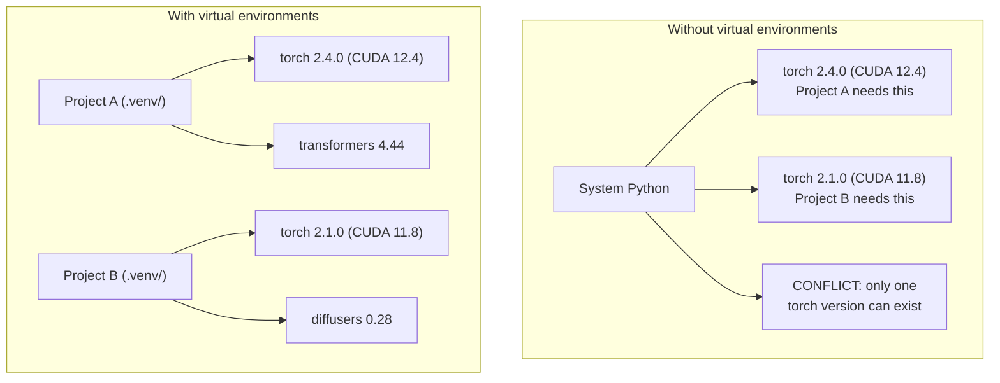

# Python Environments
Python 环境

> Dependency hell is real. Virtual environments are the cure.
> 依赖地狱是真实存在的，而虚拟环境就是解药。

**Type:** Build
**类型：** Build
**Languages:** Python
**语言：** Python
**Prerequisites:** Phase 0, Lesson 01
**前置要求：** 第 0 阶段，第 01 课
**Time:** ~30 minutes
**耗时：** 约 30 分钟

## Learning Objectives
学习目标

- Create isolated virtual environments using `uv`, `venv`, or `conda`
---
- 使用 `uv`、`venv` 或 `conda` 创建隔离的虚拟环境
- Write a `pyproject.toml` with optional dependency groups and generate lockfiles for reproducibility
---
- 编写带可选依赖组的 `pyproject.toml`，并生成 lockfile 以保证可复现性
- Diagnose and fix common pitfalls: global installs, pip/conda mixing, CUDA version mismatches
---
- 诊断并修复常见陷阱：全局安装、pip/conda 混用、CUDA 版本不匹配
- Implement a per-phase environment strategy for projects with conflicting dependencies
---
- 为存在依赖冲突的项目制定按阶段划分的环境策略

## The Problem
问题所在

You install PyTorch 2.4 for a fine-tuning project. Next week, a different project needs PyTorch 2.1 because its CUDA build is pinned. You upgrade globally, and the first project breaks. You downgrade, and the second one breaks.

你为了一个微调项目安装了 PyTorch 2.4。结果下周另一个项目又需要 PyTorch 2.1，因为它绑定了特定 CUDA 构建。你全局升级后，第一个项目坏了；你再全局降级，第二个项目又坏了。

This is dependency hell. It happens constantly in AI/ML work because:

这就是依赖地狱。在 AI/ML 工作中它极其常见，原因包括：

- PyTorch, JAX, and TensorFlow each ship their own CUDA bindings
---
- PyTorch、JAX 和 TensorFlow 都自带各自的 CUDA 绑定
- Model libraries pin specific framework versions
---
- 模型库通常会固定某些特定框架版本
- A global `pip install` overwrites whatever was there before
---
- 一次全局 `pip install` 会直接覆盖之前安装的内容
- CUDA 11.8 builds don't work with CUDA 12.x drivers (and vice versa)
---
- CUDA 11.8 构建通常不能和 CUDA 12.x 驱动直接兼容（反之亦然）

The fix: every project gets its own isolated environment with its own packages.

解决方案很简单：每个项目都应该有自己的隔离环境和独立依赖。

## The Concept
核心概念



## Build It
动手实践

### Option 1: uv venv (Recommended)
### 方案 1：uv venv（推荐）

`uv` is the fastest Python package manager (10-100x faster than pip). It handles virtual environments, Python versions, and dependency resolution in one tool.

`uv` 是目前最快的 Python 包管理工具之一（比 pip 快 10 到 100 倍）。它把虚拟环境、Python 版本管理和依赖解析整合在一个工具里。

```bash
curl -LsSf https://astral.sh/uv/install.sh | sh

uv python install 3.12

cd your-project
uv venv
source .venv/bin/activate
```

Install packages:

安装依赖包：

```bash
uv pip install torch numpy
```

Create a project with `pyproject.toml` in one step:

一步创建带 `pyproject.toml` 的项目：

```bash
uv init my-ai-project
cd my-ai-project
uv add torch numpy matplotlib
```

### Option 2: venv (Built-in)
### 方案 2：venv（内置）

If you can't install `uv`, Python ships with `venv`:

如果你不能安装 `uv`，Python 自带的 `venv` 也可以：

```bash
python3 -m venv .venv
source .venv/bin/activate  # Linux/macOS
.venv\Scripts\activate     # Windows

pip install torch numpy
```

Slower than `uv`, but works everywhere Python is installed.

它比 `uv` 慢一些，但只要系统里有 Python，就几乎都能用。

### Option 3: conda (When You Need It)
### 方案 3：conda（确实需要时再用）

Conda manages non-Python dependencies like CUDA toolkits, cuDNN, and C libraries. Use it when:

Conda 擅长管理 CUDA toolkit、cuDNN、C 库等非 Python 依赖。适合这些场景：

- You need a specific CUDA toolkit version without installing it system-wide
---
- 你需要某个特定 CUDA toolkit 版本，但不想在系统级安装
- You're on a shared cluster where you can't install system packages
---
- 你在共享集群上工作，无法安装系统包
- A library's install instructions say "use conda"
---
- 某个库的官方安装说明明确要求“use conda”

```bash
# Install miniconda (not the full Anaconda)
curl -LsSf https://repo.anaconda.com/miniconda/Miniconda3-latest-Linux-x86_64.sh -o miniconda.sh
bash miniconda.sh -b

conda create -n myproject python=3.12
conda activate myproject

conda install pytorch torchvision torchaudio pytorch-cuda=12.4 -c pytorch -c nvidia
```

One rule: if you use conda for an environment, use conda for all packages in that environment. Mixing `pip install` into a conda env causes dependency conflicts that are painful to debug.

一个重要原则：如果某个环境是用 conda 管理的，那这个环境里的所有包最好都交给 conda 管理。把 `pip install` 混进 conda 环境，通常会制造非常难排查的依赖冲突。

### For This Course: Per-Phase Strategy
### 对这门课程来说：按阶段划分环境策略

You could create one environment for the whole course. Don't. Different phases need different (sometimes conflicting) dependencies.

你当然可以尝试为整门课只创建一个环境，但不建议这么做。不同阶段会依赖不同、甚至互相冲突的包版本。

Strategy:

建议策略：

```
ai-engineering-from-scratch/
├── .venv/                    <-- shared lightweight env for phases 0-3
├── phases/
│   ├── 04-neural-networks/
│   │   └── .venv/            <-- PyTorch env
│   ├── 05-cnns/
│   │   └── .venv/            <-- same PyTorch env (symlink or shared)
│   ├── 08-transformers/
│   │   └── .venv/            <-- might need different transformer versions
│   └── 11-llm-apis/
│       └── .venv/            <-- API SDKs, no torch needed
```

The script in `code/env_setup.sh` creates the base environment for this course.

`code/env_setup.sh` 中的脚本会为这门课创建基础环境。

## pyproject.toml Basics
`pyproject.toml` 基础

Every Python project should have a `pyproject.toml`. It replaces `setup.py`, `setup.cfg`, and `requirements.txt` in one file.

每个 Python 项目都应该有一个 `pyproject.toml`。它把 `setup.py`、`setup.cfg` 和 `requirements.txt` 的职责统一到一个文件里。

```toml
[project]
name = "ai-engineering-from-scratch"
version = "0.1.0"
requires-python = ">=3.11"
dependencies = [
    "numpy>=1.26",
    "matplotlib>=3.8",
    "jupyter>=1.0",
    "scikit-learn>=1.4",
]

[project.optional-dependencies]
torch = ["torch>=2.3", "torchvision>=0.18"]
llm = ["anthropic>=0.39", "openai>=1.50"]
```

Then install:

然后这样安装：

```bash
uv pip install -e ".[torch]"    # base + PyTorch
uv pip install -e ".[llm]"     # base + LLM SDKs
uv pip install -e ".[torch,llm]" # everything
```

## Lockfiles
锁文件

A lockfile pins every dependency (including transitive ones) to exact versions. This guarantees reproducibility: anyone who installs from the lockfile gets exactly the same packages.

Lockfile 会把每一个依赖（包括传递依赖）都固定到精确版本。这能保证可复现性：任何人只要按 lockfile 安装，就会得到完全相同的包版本。

```bash
# uv generates uv.lock automatically when using uv add
uv add numpy

# pip-tools approach
uv pip compile pyproject.toml -o requirements.lock
uv pip install -r requirements.lock
```

Commit your lockfile to git. When someone clones the repo, they install from the lockfile and get identical versions.

请把 lockfile 提交到 git。这样别人克隆仓库后，就可以通过 lockfile 安装出完全一致的环境。

## Common Mistakes
常见错误

### 1. Installing globally
### 1. 全局安装

```bash
pip install torch  # BAD: installs to system Python

source .venv/bin/activate
pip install torch  # GOOD: installs to virtual environment
```

Check where your packages go:

检查你的包到底装到了哪里：

```bash
which python       # should show .venv/bin/python, not /usr/bin/python
which pip           # should show .venv/bin/pip
```

### 2. Mixing pip and conda
### 2. 混用 pip 和 conda

```bash
conda create -n myenv python=3.12
conda activate myenv
conda install pytorch -c pytorch
pip install some-other-package   # BAD: can break conda's dependency tracking
conda install some-other-package # GOOD: let conda manage everything
```

If you must use pip inside conda (some packages are pip-only), install all conda packages first, then pip packages last.

如果你确实必须在 conda 环境里用 pip（有些包只有 pip 版本），那就先把所有 conda 包装完，再最后安装 pip 包。

### 3. Forgetting to activate
### 3. 忘记激活环境

```bash
python train.py           # uses system Python, missing packages
source .venv/bin/activate
python train.py           # uses project Python, packages found
```

Your shell prompt should show the environment name:

你的 shell 提示符应该显示环境名：

```
(.venv) $ python train.py
```

### 4. Committing .venv to git
### 4. 把 .venv 提交进 git

```bash
echo ".venv/" >> .gitignore
```

Virtual environments are 200MB-2GB. They're local, not portable between machines. Commit `pyproject.toml` and the lockfile instead.

虚拟环境通常有 200MB 到 2GB 之大，而且它们是本地的、不可跨机器直接复用。请提交 `pyproject.toml` 和 lockfile，而不是 `.venv` 本身。

### 5. CUDA version mismatch
### 5. CUDA 版本不匹配

```bash
nvidia-smi                # shows driver CUDA version (e.g., 12.4)
python -c "import torch; print(torch.version.cuda)"  # shows PyTorch CUDA version

# These must be compatible.
# PyTorch CUDA version must be <= driver CUDA version.
```

## Use It
实际使用

Run the setup script to create your course environment:

运行下面的脚本来创建课程环境：

```bash
bash phases/00-setup-and-tooling/06-python-environments/code/env_setup.sh
```

This creates a `.venv` at the repo root with core dependencies installed and verified.

它会在仓库根目录创建一个 `.venv`，并安装、验证核心依赖。

## Exercises
练习

1. Run `env_setup.sh` and verify all checks pass
---
1. 运行 `env_setup.sh`，并确认所有检查都通过
2. Create a second virtual environment, install a different version of numpy in it, and confirm the two environments are isolated
---
2. 再创建一个虚拟环境，在里面安装不同版本的 numpy，并确认这两个环境是互相隔离的
3. Write a `pyproject.toml` for a project that needs both PyTorch and the Anthropic SDK
---
3. 为一个同时需要 PyTorch 和 Anthropic SDK 的项目编写 `pyproject.toml`
4. Deliberately install a package globally (without activating a venv), notice where it goes, then uninstall it
---
4. 故意在未激活 venv 的情况下全局安装一个包，观察它被装到哪里，然后再卸载它

## Key Terms
关键术语

| Term | What people say | What it actually means |
|------|----------------|----------------------|
| Virtual environment | "A venv" | An isolated directory containing a Python interpreter and packages, separate from the system Python |
| Lockfile | "Pinned dependencies" | A file listing every package and its exact version, guaranteeing identical installs across machines |
| pyproject.toml | "The new setup.py" | The standard Python project configuration file, replacing setup.py/setup.cfg/requirements.txt |
| Transitive dependency | "A dependency of a dependency" | Package B depends on C; if you install A which depends on B, C is a transitive dependency of A |
| CUDA mismatch | "My GPU isn't working" | PyTorch was compiled for a different CUDA version than what your GPU driver supports |

| 术语 | 人们常说的意思 | 实际含义 |
|------|----------------|----------|
| Virtual environment | “一个 venv” | 一个独立目录，里面包含 Python 解释器和依赖包，与系统 Python 隔离 |
| Lockfile | “固定版本依赖” | 记录每个包及其精确版本的文件，保证不同机器上安装结果一致 |
| pyproject.toml | “新的 setup.py” | Python 项目的标准配置文件，用来替代 setup.py/setup.cfg/requirements.txt |
| Transitive dependency | “依赖的依赖” | 如果包 A 依赖 B，而 B 又依赖 C，那么 C 就是 A 的传递依赖 |
| CUDA mismatch | “我的 GPU 不工作了” | PyTorch 编译时使用的 CUDA 版本和你的 GPU 驱动支持版本不兼容 |
